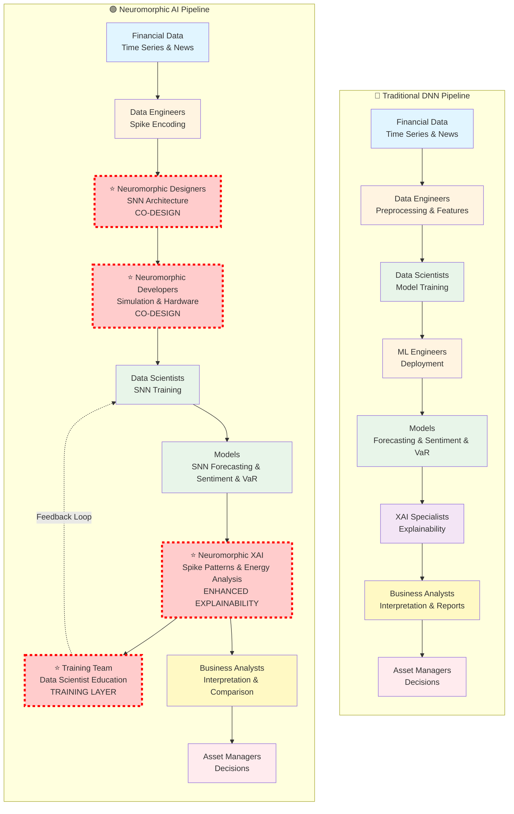

# AI Pipeline Architecture: DNN vs Neuromorphic AI

This document outlines the pipeline architectures for both traditional Deep Neural Networks (DNN) and Neuromorphic AI systems used for financial time series forecasting, sentiment analysis, and VaR estimation.

## Use Case Overview

**Objective**: Apply time series forecasting and sentiment analysis for:
- **VaR (Value at Risk) Estimation**: Quantify potential losses in financial portfolios
- **Sentiment Estimation**: Analyze financial news and market commentary sentiment

**Key Requirements**:
- Data explainability for data scientists
- Results explanation for business analysts
- Translation to asset managers for decision-making
- Neuromorphic AI integration alongside traditional DNNs

---

## Pipeline Comparison: DNN vs Neuromorphic AI

### Side-by-Side Architecture Comparison

### Key Differences Highlighted

**⭐ Extra Steps in Neuromorphic Pipeline:**

1. **Neuromorphic Designers (CO-DESIGN)**: SNN architecture design and neuron model selection - *Not present in DNN pipeline*
2. **Neuromorphic Developers (CO-DESIGN)**: Simulation frameworks and hardware deployment - *Not present in DNN pipeline*
3. **Neuromorphic XAI (ENHANCED EXPLAINABILITY)**: Spike pattern analysis, temporal dynamics, and energy efficiency metrics - *More comprehensive than standard XAI*
4. **Training Team (TRAINING LAYER)**: Continuous education loop for data scientists on neuromorphic concepts - *Unique feedback mechanism*

### Key Roles Comparison

#### DNN Pipeline Roles:
1. **Data Engineers**: Data preprocessing and feature engineering
2. **Data Scientists**: Model design, training, and validation
3. **ML Engineers**: Model deployment and production systems
4. **XAI Specialists**: Model explainability and interpretability
5. **Business Analysts**: Results interpretation and reporting
6. **Asset Managers**: Final portfolio and risk management decisions

#### Neuromorphic AI Pipeline Roles:
1. **Data Engineers**: Data preprocessing and spike encoding
2. **⭐ Neuromorphic Designers**: SNN architecture and neuron model design *(NEW)*
3. **⭐ Neuromorphic Developers**: Simulation frameworks and hardware deployment *(NEW)*
4. **Data Scientists**: SNN training and validation (with neuromorphic training)
5. **⭐ Neuromorphic XAI Specialists**: Enhanced explainability with spike patterns and energy analysis *(ENHANCED)*
6. **⭐ Training Team**: Educating data scientists on neuromorphic AI concepts *(NEW - Feedback Loop)*
7. **Business Analysts**: Results interpretation and DNN vs SNN comparison
8. **Asset Managers**: Final portfolio and risk management decisions

---

## Key Differences: DNN vs Neuromorphic AI Pipeline

### 1. **Data Preprocessing**
- **DNN**: Standard feature engineering and normalization
- **Neuromorphic**: Spike encoding (rate coding, temporal coding), neuromorphic format conversion

### 2. **Model Design**
- **DNN**: Layer architecture, activation functions, loss functions
- **Neuromorphic**: SNN topology, neuron models (LIF, AdEx, Izhikevich), synaptic plasticity rules (STDP)

### 3. **Development & Deployment**
- **DNN**: Standard ML frameworks (TensorFlow, PyTorch), GPU/CPU deployment
- **Neuromorphic**: Specialized simulators (NEST, Brian2, SpiNNaker), neuromorphic hardware (Loihi, TrueNorth)

### 4. **Explainability**
- **DNN**: LIME, SHAP, attention maps, feature importance
- **Neuromorphic**: Spike patterns, neuron activation maps, temporal dynamics, synaptic weights, energy efficiency

### 5. **Additional Layers**
- **Neuromorphic**: 
  - Neuromorphic Design Team (architecture and hardware mapping)
  - Neuromorphic Development Team (simulation and hardware deployment)
  - Data Science Training Layer (familiarization with neuromorphic concepts)
  - Enhanced explainability for spike-based computations

### 6. **Business Value**
- **DNN**: Standard performance metrics
- **Neuromorphic**: Energy efficiency benefits, real-time processing capabilities, comparative analysis with DNN

---

## Integration Strategy

### Hybrid Approach
Both pipelines can operate in parallel:
- **DNN Pipeline**: Baseline models, established workflows
- **Neuromorphic Pipeline**: Energy-efficient alternatives, real-time processing, edge deployment

### Unified Explainability
- Comparative analysis between DNN and SNN predictions
- Cross-validation of results
- Unified reporting to business analysts

### Training & Transition
- Gradual introduction of neuromorphic concepts to data scientists
- Tool familiarization programs
- Best practices documentation
- Mentorship from neuromorphic specialists

---

## Benefits of Neuromorphic AI Integration

1. **Energy Efficiency**: Significantly lower power consumption for inference
2. **Real-time Processing**: Ultra-low latency for time-critical financial decisions
3. **Edge Deployment**: Deploy models on neuromorphic hardware at the edge
4. **Temporal Processing**: Natural handling of temporal dynamics in financial data
5. **Complementary Insights**: Different perspective on the same data, improving robustness

---

## Next Steps

1. **Phase 1**: Set up neuromorphic simulation environment
2. **Phase 2**: Develop spike encoding pipelines for financial data
3. **Phase 3**: Design SNN architectures for time series and sentiment analysis
4. **Phase 4**: Implement neuromorphic explainability tools
5. **Phase 5**: Train data science team on neuromorphic concepts
6. **Phase 6**: Deploy hybrid DNN/SNN system with comparative analysis
7. **Phase 7**: Integrate with existing dashboard and reporting systems

