# Neuromorphic AI Integration - Simplified Comparison

## Side-by-Side Pipeline Comparison

This diagram shows the key differences when introducing Neuromorphic AI into an existing AI business process. Horizontal lines indicate what remains the same, while highlighted sections show what changes.

```mermaid
flowchart LR
    subgraph INPUT[" "]
        DATA[Financial Data<br/>Time Series & News]
    end
    
    subgraph TRAD["Traditional DNN Pipeline"]
        direction TB
        DE1[Data Engineers]
        PREP1[Data Preprocessing]
        DS1[Data Scientists]
        TRAIN1[Model Training]
        MODELS1[Models:<br/>Forecasting & Sentiment & VaR]
        XAI1[XAI Specialists]
        BA1[Business Analysts]
        DEC1[Asset Managers<br/>Decisions]
        
        DE1 --> PREP1
        PREP1 --> DS1
        DS1 --> TRAIN1
        TRAIN1 --> MODELS1
        MODELS1 --> XAI1
        XAI1 --> BA1
        BA1 --> DEC1
    end
    
    subgraph NEURO["Neuromorphic AI Pipeline"]
        direction TB
        DE2[Data Engineers]
        PREP2[Data Preprocessing]
        SPIKE["⭐ Spike Encoding<br/>NEW"]
        ND["⭐ Neuromorphic Designers<br/>SNN Architecture<br/>NEW"]
        CODESIGN["⭐ Neuromorphic Developers<br/>Simulation & Hardware Co-Design<br/>NEW"]
        DS2[Data Scientists]
        TRAIN2[SNN Training]
        MODELS2[Models:<br/>SNN Forecasting & Sentiment & VaR]
        NXAI["⭐ Neuromorphic XAI<br/>Spike Patterns & Energy Analysis<br/>ENHANCED EXPLAINABILITY"]
        TRAINING["⭐ Training Team<br/>Data Scientist Education<br/>NEW"]
        BA2[Business Analysts]
        DEC2[Asset Managers<br/>Decisions]
        
        DE2 --> PREP2
        PREP2 --> SPIKE
        SPIKE --> ND
        ND --> CODESIGN
        CODESIGN --> DS2
        DS2 --> TRAIN2
        TRAIN2 --> MODELS2
        MODELS2 --> NXAI
        NXAI --> TRAINING
        TRAINING -.->|Feedback Loop| DS2
        NXAI --> BA2
        BA2 --> DEC2
    end
    
    DATA --> DE1
    DATA --> DE2
    
    %% Horizontal alignment lines (same roles)
    DE1 -.->|Same| DE2
    PREP1 -.->|Same| PREP2
    DS1 -.->|Same| DS2
    BA1 -.->|Same| BA2
    DEC1 -.->|Same| DEC2
    
    %% Styling
    classDef common fill:#e1f5ff,stroke:#1976d2,stroke-width:2px
    classDef traditional fill:#fff4e1,stroke:#f57c00,stroke-width:2px
    classDef neuromorphic fill:#e8f5e9,stroke:#388e3c,stroke-width:2px
    classDef new fill:#ffebee,stroke:#d32f2f,stroke-width:3px,stroke-dasharray: 5 5
    classDef enhanced fill:#f3e5f5,stroke:#7b1fa2,stroke-width:3px
    
    class DATA common
    class DE1,PREP1,DS1,TRAIN1,MODELS1,XAI1,BA1,DEC1 traditional
    class DE2,PREP2,DS2,TRAIN2,MODELS2,BA2,DEC2 neuromorphic
    class SPIKE,ND,CODESIGN,TRAINING new
    class NXAI enhanced
```

## Key Differences Summary

### What Remains the Same:
- **Input**: Financial Data (Time Series & News)
- **Data Engineers**: Data preprocessing role
- **Data Scientists**: Model training role
- **Business Analysts**: Results interpretation
- **Asset Managers**: Final decision making

### What Changes (Neuromorphic Additions):

1. **⭐⭐ Spike Encoding** (NEW)
   - Converts traditional data to spike-based format
   - Required for neuromorphic hardware compatibility

2. **⭐⭐ Neuromorphic Designers** (NEW ROLE)
   - Design SNN architectures
   - Hardware/software co-design

3. **⭐⭐ Hardware Co-Design** (NEW PROCESS)
   - SNN Architecture Design
   - Simulation & Hardware Co-Design
   - Neuromorphic Developers involved

4. **⭐⭐ Enhanced Explainability** (ENHANCED)
   - Neuromorphic XAI with Spike Patterns & Energy Analysis
   - More detailed explainability than traditional XAI

5. **⭐⭐ Training Team & Education** (NEW)
   - Data Scientist Education on neuromorphic concepts
   - Feedback loop for continuous learning
   - Training on SNN fundamentals and tools

## Integration Impact

| Aspect | Traditional DNN | Neuromorphic AI | Impact |
|--------|---------------|-----------------|--------|
| **Data Format** | Standard numeric/text | Spike-encoded | Requires conversion step |
| **Hardware** | General-purpose (CPU/GPU) | Specialized neuromorphic chips | Hardware investment needed |
| **Explainability** | Standard XAI methods | Enhanced with spike patterns & energy analysis | Better interpretability |
| **Team Skills** | Standard ML skills | Neuromorphic + ML skills | Training required |
| **Energy Efficiency** | Standard | Significantly lower | Cost savings |
| **Real-time Processing** | Standard | Enhanced | Better for time-sensitive decisions |

