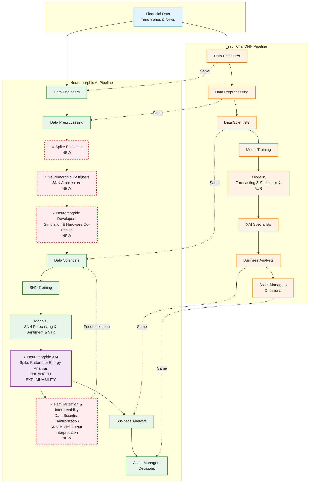

# Neuromorphic AI Integration - Report Diagram

## Simplified Side-by-Side Comparison

This diagram clearly shows what remains the same and what changes when introducing Neuromorphic AI into an existing AI business process.

## Key Differences

### ✅ What Remains the Same (Horizontal Alignment):
- **Data Engineers**: Same role, same preprocessing
- **Data Scientists**: Same role, focus on model training (deployment handled by Neuromorphic Developers)
- **Business Analysts**: Same role, enhanced interpretation
- **Asset Managers**: Same decision-making role

### ⭐ What Changes (Neuromorphic Additions):

1. **Spike Encoding** → Converts data to neuromorphic format
2. **Neuromorphic Designers** → New role for SNN architecture design
3. **Neuromorphic Developers** → New role for hardware co-design and deployment (Note: Typical data scientists focus on training, not deployment)
4. **Enhanced XAI** → Spike patterns & energy analysis (better explainability)
5. **Familiarization & Interpretability Layer** → Data scientist familiarization with SNN models and interpretation of their outputs (feedback loop for continuous learning)

## Integration Requirements

| Component | Traditional DNN | Neuromorphic AI | Change Required |
|-----------|-----------------|-----------------|-----------------|
| **Data Format** | Standard | Spike-encoded | ⚠️ Conversion needed |
| **Team Roles** | Standard ML | + Neuromorphic specialists | ⚠️ New hires/training |
| **Hardware** | CPU/GPU | Neuromorphic chips | ⚠️ Hardware investment |
| **Explainability** | Standard XAI | Enhanced XAI | ✅ Better insights |
| **Energy Usage** | Standard | Significantly lower | ✅ Cost savings |

